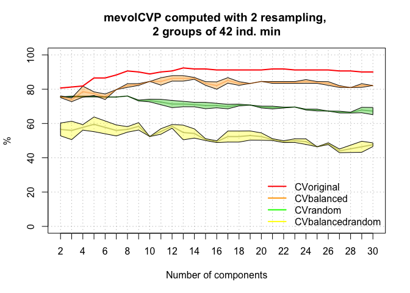

[](https://travis-ci.org/vbonhomme/mevolCVP) <!--
[](https://cran.r-project.org/package=mevolCVP)
--> <!-- README.md is generated from README.Rmd. Please edit that file -->

mevolCVP
========

The goal of mevolCVP is to ...

Installation
------------

You will be able to install the (once) released version of mevolCVP from [CRAN](https://CRAN.R-project.org) with:

``` r
install.packages("mevolCVP")
```

so far you can:

``` r
devtools::install_github("vbonhomme/mevolCVP")
#> Downloading GitHub repo vbonhomme/mevolCVP@master
#> from URL https://api.github.com/repos/vbonhomme/mevolCVP/zipball/master
#> Installing mevolCVP
#> '/Library/Frameworks/R.framework/Resources/bin/R' --no-site-file  \
#>   --no-environ --no-save --no-restore --quiet CMD INSTALL  \
#>   '/private/var/folders/71/xqm_5j310_j1jg6mfb5xlr_w0000gn/T/RtmpzqZALD/devtoolsb0657a63db1b/vbonhomme-mevolCVP-7fe5589'  \
#>   --library='/Users/vincent/Library/R/3.4/library' --install-tests
#> 
```

Example
-------

This is a basic example which shows you how to solve a common problem:

``` r
library(mevolCVP)
mevol_CVP(pig$mat, pig$gp, nrep=2)
#> [1] "The analyses are done with 2 groups"
#> group
#>  DP  WB 
#>  42 129
```



    #> $CVoriginal
    #>  [1] 80.70175 81.28655 81.87135 86.54971 86.54971 88.30409 90.64327
    #>  [8] 90.05848 88.88889 90.05848 90.64327 92.39766 91.81287 91.81287
    #> [15] 91.22807 91.22807 91.22807 91.22807 91.22807 91.81287 91.81287
    #> [22] 91.22807 91.22807 91.22807 91.22807 90.64327 90.64327 90.05848
    #> [29] 90.05848
    #> 
    #> $CVbalanced
    #>          2PCs     3PCs     4PCs     5PCs     6PCs     7PCs     8PCs
    #> [1,] 78.57143 78.57143 85.71429 85.71429 84.52381 82.14286 83.33333
    #> [2,] 76.19048 75.00000 86.90476 86.90476 84.52381 84.52381 85.71429
    #>          9PCs    10PCs    11PCs    12PCs    13PCs    14PCs    15PCs
    #> [1,] 85.71429 90.47619 89.28571 89.28571 88.09524 88.09524 88.09524
    #> [2,] 86.90476 85.71429 84.52381 88.09524 89.28571 90.47619 90.47619
    #>         16PCs    17PCs    18PCs    19PCs    20PCs    21PCs    22PCs
    #> [1,] 89.28571 88.09524 88.09524 88.09524 88.09524 86.90476 91.66667
    #> [2,] 90.47619 89.28571 90.47619 89.28571 89.28571 86.90476 88.09524
    #>         23PCs    24PCs    25PCs    26PCs    27PCs    28PCs    29PCs
    #> [1,] 90.47619 91.66667 91.66667 91.66667 91.66667 90.47619 90.47619
    #> [2,] 88.09524 85.71429 84.52381 84.52381 83.33333 83.33333 83.33333
    #>         30PCs
    #> [1,] 89.28571
    #> [2,] 83.33333
    #> 
    #> $CVrandom
    #>         2PCs    3PCs    4PCs    5PCs    6PCs    7PCs     8PCs     9PCs
    #> [1,] 75.4386 75.4386 75.4386 74.8538 74.8538 74.8538 74.85380 73.68421
    #> [2,] 75.4386 75.4386 75.4386 75.4386 75.4386 74.8538 74.26901 74.85380
    #>         10PCs    11PCs    12PCs    13PCs    14PCs    15PCs    16PCs
    #> [1,] 73.68421 73.68421 74.85380 74.85380 74.26901 72.51462 72.51462
    #> [2,] 74.85380 73.68421 73.68421 73.68421 73.09942 73.68421 73.68421
    #>         17PCs    18PCs    19PCs    20PCs    21PCs    22PCs    23PCs
    #> [1,] 72.51462 71.92982 71.34503 71.34503 70.76023 70.17544 70.17544
    #> [2,] 73.09942 73.68421 71.34503 71.34503 73.09942 71.34503 72.51462
    #>         24PCs    25PCs    26PCs    27PCs    28PCs    29PCs    30PCs
    #> [1,] 69.00585 68.42105 67.25146 66.66667 67.83626 67.25146 66.08187
    #> [2,] 72.51462 71.34503 71.34503 69.59064 69.59064 69.00585 68.42105
    #> 
    #> $CVbalancedrandom
    #>          2PCs     3PCs     4PCs     5PCs     6PCs     7PCs     8PCs
    #> [1,] 40.47619 39.28571 44.04762 40.47619 33.33333 32.14286 34.52381
    #> [2,] 50.00000 46.42857 53.57143 55.95238 47.61905 47.61905 45.23810
    #>          9PCs    10PCs    11PCs    12PCs    13PCs    14PCs    15PCs
    #> [1,] 33.33333 34.52381 33.33333 41.66667 51.19048 50.00000 52.38095
    #> [2,] 46.42857 60.71429 59.52381 60.71429 60.71429 63.09524 58.33333
    #>         16PCs    17PCs    18PCs    19PCs    20PCs    21PCs    22PCs
    #> [1,] 46.42857 47.61905 46.42857 47.61905 50.00000 47.61905 45.23810
    #> [2,] 58.33333 58.33333 57.14286 59.52381 55.95238 53.57143 51.19048
    #>         23PCs    24PCs    25PCs    26PCs    27PCs    28PCs    29PCs
    #> [1,] 42.85714 42.85714 42.85714 42.85714 45.23810 46.42857 42.85714
    #> [2,] 54.76190 58.33333 57.14286 60.71429 59.52381 54.76190 54.76190
    #>         30PCs
    #> [1,] 41.66667
    #> [2,] 54.76190
    #> 
    #> $CVsummary
    #>       mean-CVbalanced CI5%-CVbalanced CI95%-CVbalanced mean-CVrandom
    #> 2PCs         77.38095        76.30952         78.45238      75.43860
    #> 3PCs         76.78571        75.17857         78.39286      75.43860
    #> 4PCs         86.30952        85.77381         86.84524      75.43860
    #> 5PCs         86.30952        85.77381         86.84524      75.14620
    #> 6PCs         84.52381        84.52381         84.52381      75.14620
    #> 7PCs         83.33333        82.26190         84.40476      74.85380
    #> 8PCs         84.52381        83.45238         85.59524      74.56140
    #> 9PCs         86.30952        85.77381         86.84524      74.26901
    #> 10PCs        88.09524        85.95238         90.23810      74.26901
    #> 11PCs        86.90476        84.76190         89.04762      73.68421
    #> 12PCs        88.69048        88.15476         89.22619      74.26901
    #> 13PCs        88.69048        88.15476         89.22619      74.26901
    #> 14PCs        89.28571        88.21429         90.35714      73.68421
    #> 15PCs        89.28571        88.21429         90.35714      73.09942
    #> 16PCs        89.88095        89.34524         90.41667      73.09942
    #> 17PCs        88.69048        88.15476         89.22619      72.80702
    #> 18PCs        89.28571        88.21429         90.35714      72.80702
    #> 19PCs        88.69048        88.15476         89.22619      71.34503
    #> 20PCs        88.69048        88.15476         89.22619      71.34503
    #> 21PCs        86.90476        86.90476         86.90476      71.92982
    #> 22PCs        89.88095        88.27381         91.48810      70.76023
    #> 23PCs        89.28571        88.21429         90.35714      71.34503
    #> 24PCs        88.69048        86.01190         91.36905      70.76023
    #> 25PCs        88.09524        84.88095         91.30952      69.88304
    #> 26PCs        88.09524        84.88095         91.30952      69.29825
    #> 27PCs        87.50000        83.75000         91.25000      68.12865
    #> 28PCs        86.90476        83.69048         90.11905      68.71345
    #> 29PCs        86.90476        83.69048         90.11905      68.12865
    #> 30PCs        86.30952        83.63095         88.98810      67.25146
    #>       CI5%-CVrandom CI95%-CVrandom mean-CVbalancedrandom
    #> 2PCs       75.43860       75.43860              45.23810
    #> 3PCs       75.43860       75.43860              42.85714
    #> 4PCs       75.43860       75.43860              48.80952
    #> 5PCs       74.88304       75.40936              48.21429
    #> 6PCs       74.88304       75.40936              40.47619
    #> 7PCs       74.85380       74.85380              39.88095
    #> 8PCs       74.29825       74.82456              39.88095
    #> 9PCs       73.74269       74.79532              39.88095
    #> 10PCs      73.74269       74.79532              47.61905
    #> 11PCs      73.68421       73.68421              46.42857
    #> 12PCs      73.74269       74.79532              51.19048
    #> 13PCs      73.74269       74.79532              55.95238
    #> 14PCs      73.15789       74.21053              56.54762
    #> 15PCs      72.57310       73.62573              55.35714
    #> 16PCs      72.57310       73.62573              52.38095
    #> 17PCs      72.54386       73.07018              52.97619
    #> 18PCs      72.01754       73.59649              51.78571
    #> 19PCs      71.34503       71.34503              53.57143
    #> 20PCs      71.34503       71.34503              52.97619
    #> 21PCs      70.87719       72.98246              50.59524
    #> 22PCs      70.23392       71.28655              48.21429
    #> 23PCs      70.29240       72.39766              48.80952
    #> 24PCs      69.18129       72.33918              50.59524
    #> 25PCs      68.56725       71.19883              50.00000
    #> 26PCs      67.45614       71.14035              51.78571
    #> 27PCs      66.81287       69.44444              52.38095
    #> 28PCs      67.92398       69.50292              50.59524
    #> 29PCs      67.33918       68.91813              48.80952
    #> 30PCs      66.19883       68.30409              48.21429
    #>       CI5%-CVbalancedrandom CI95%-CVbalancedrandom
    #> 2PCs               40.95238               49.52381
    #> 3PCs               39.64286               46.07143
    #> 4PCs               44.52381               53.09524
    #> 5PCs               41.25000               55.17857
    #> 6PCs               34.04762               46.90476
    #> 7PCs               32.91667               46.84524
    #> 8PCs               35.05952               44.70238
    #> 9PCs               33.98810               45.77381
    #> 10PCs              35.83333               59.40476
    #> 11PCs              34.64286               58.21429
    #> 12PCs              42.61905               59.76190
    #> 13PCs              51.66667               60.23810
    #> 14PCs              50.65476               62.44048
    #> 15PCs              52.67857               58.03571
    #> 16PCs              47.02381               57.73810
    #> 17PCs              48.15476               57.79762
    #> 18PCs              46.96429               56.60714
    #> 19PCs              48.21429               58.92857
    #> 20PCs              50.29762               55.65476
    #> 21PCs              47.91667               53.27381
    #> 22PCs              45.53571               50.89286
    #> 23PCs              43.45238               54.16667
    #> 24PCs              43.63095               57.55952
    #> 25PCs              43.57143               56.42857
    #> 26PCs              43.75000               59.82143
    #> 27PCs              45.95238               58.80952
    #> 28PCs              46.84524               54.34524
    #> 29PCs              43.45238               54.16667
    #> 30PCs              42.32143               54.10714

More to come.
