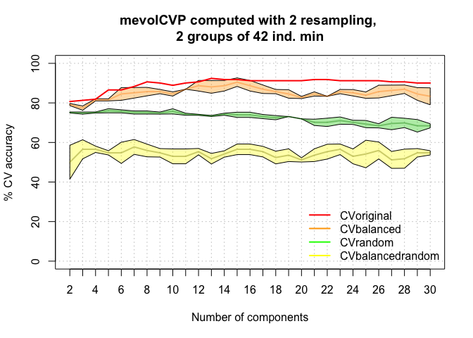

<!--
[](https://cran.r-project.org/package=mevolCVP)
-->
<!-- README.md is generated from README.Rmd. Please edit that file -->

# mevolCVP

The goal of mevolCVP is to …

## Installation

You will be able to install the (once) released version of mevolCVP from
[CRAN](https://CRAN.R-project.org) with:

``` r
install.packages("mevolCVP")
```

so far you can (provinding `remotes` is installed):

``` r
remotes::install_github("vbonhomme/mevolCVP")
#> Using github PAT from envvar GITHUB_PAT
#> Downloading GitHub repo vbonhomme/mevolCVP@HEAD
#> * checking for file ‘/private/var/folders/02/qxs2_mmd301bj9dsvq6hgkj40000gp/T/RtmpYKsDM5/remotesaaac3d139fbc/vbonhomme-mevolCVP-ccd5a2e/DESCRIPTION’ ... OK
#> * preparing ‘mevolCVP’:
#> * checking DESCRIPTION meta-information ... OK
#> * checking for LF line-endings in source and make files and shell scripts
#> * checking for empty or unneeded directories
#> * building ‘mevolCVP_0.1.1.tar.gz’
#> Installing package into '/private/var/folders/02/qxs2_mmd301bj9dsvq6hgkj40000gp/T/Rtmp3L7fAu/temp_libpatha34a464244c9'
#> (as 'lib' is unspecified)
#> Adding 'mevolCVP_0.1.1.tgz' to the cache
```

## Example

This is a basic example which shows you how to solve a common problem:

``` r
library(mevolCVP)       # load the package
set.seed(2329)          # for the sake of replicability
mevol_CVP(pig$mat, pig$gp, nrep=2) # run mevolCVP with 2 iterations (speed purpose)
#> [1] "The analyses are done with 2 groups"
#> group
#>  DP  WB 
#>  42 129
```



    #> $CVoriginal
    #>  [1] 80.70175 81.28655 81.87135 86.54971 86.54971 88.30409 90.64327 90.05848
    #>  [9] 88.88889 90.05848 90.64327 92.39766 91.81287 91.81287 91.22807 91.22807
    #> [17] 91.22807 91.22807 91.22807 91.81287 91.81287 91.22807 91.22807 91.22807
    #> [25] 91.22807 90.64327 90.64327 90.05848 90.05848
    #> 
    #> $CVbalanced
    #>          2PCs     3PCs     4PCs     5PCs     6PCs     7PCs     8PCs     9PCs
    #> [1,] 79.76190 78.57143 82.14286 82.14286 88.09524 88.09524 88.09524 86.90476
    #> [2,] 78.57143 76.19048 80.95238 80.95238 80.95238 82.14286 83.33333 84.52381
    #>         10PCs    11PCs    12PCs    13PCs    14PCs    15PCs    16PCs    17PCs
    #> [1,] 85.71429 86.90476 91.66667 91.66667 91.66667 92.85714 91.66667 89.28571
    #> [2,] 83.33333 86.90476 85.71429 84.52381 85.71429 88.09524 85.71429 84.52381
    #>         18PCs    19PCs    20PCs    21PCs    22PCs    23PCs    24PCs    25PCs
    #> [1,] 86.90476 86.90476 83.33333 85.71429 83.33333 86.90476 86.90476 85.71429
    #> [2,] 84.52381 82.14286 82.14286 83.33333 83.33333 84.52381 83.33333 82.14286
    #>         26PCs    27PCs    28PCs    29PCs    30PCs
    #> [1,] 89.28571 89.28571 89.28571 88.09524 88.09524
    #> [2,] 82.14286 83.33333 84.52381 80.95238 78.57143
    #> 
    #> $CVrandom
    #>         2PCs     3PCs    4PCs     5PCs     6PCs     7PCs     8PCs     9PCs
    #> [1,] 75.4386 75.43860 75.4386 74.85380 74.85380 74.26901 74.26901 74.26901
    #> [2,] 74.8538 74.26901 74.8538 77.19298 76.60819 76.02339 76.02339 75.43860
    #>         10PCs    11PCs    12PCs    13PCs    14PCs    15PCs    16PCs    17PCs
    #> [1,] 74.26901 73.68421 73.68421 73.68421 73.68421 72.51462 72.51462 71.92982
    #> [2,] 77.19298 74.85380 74.26901 73.09942 74.85380 75.43860 75.43860 74.26901
    #>         18PCs    19PCs    20PCs    21PCs    22PCs    23PCs    24PCs    25PCs
    #> [1,] 71.34503 73.09942 71.92982 68.42105 67.83626 69.00585 69.00585 67.25146
    #> [2,] 73.68421 73.09942 71.92982 71.92982 72.51462 73.09942 71.34503 71.34503
    #>         26PCs    27PCs    28PCs    29PCs    30PCs
    #> [1,] 67.25146 66.08187 67.25146 64.91228 67.25146
    #> [2,] 69.59064 73.09942 72.51462 71.92982 69.59064
    #> 
    #> $CVbalancedrandom
    #>          2PCs     3PCs     4PCs     5PCs     6PCs     7PCs     8PCs     9PCs
    #> [1,] 40.47619 51.19048 54.76190 53.57143 48.80952 53.57143 52.38095 52.38095
    #> [2,] 59.52381 61.90476 58.33333 55.95238 60.71429 61.90476 59.52381 57.14286
    #>         10PCs    11PCs    12PCs    13PCs    14PCs    15PCs    16PCs    17PCs
    #> [1,] 48.80952 48.80952 53.57143 48.80952 52.38095 59.52381 59.52381 58.33333
    #> [2,] 57.14286 57.14286 57.14286 54.76190 55.95238 53.57143 53.57143 52.38095
    #>         18PCs    19PCs    20PCs    21PCs    22PCs    23PCs    24PCs    25PCs
    #> [1,] 55.95238 57.14286 52.38095 57.14286 59.52381 59.52381 57.14286 61.90476
    #> [2,] 48.80952 50.00000 50.00000 50.00000 51.19048 53.57143 48.80952 46.42857
    #>         26PCs    27PCs    28PCs    29PCs    30PCs
    #> [1,] 60.71429 55.95238 57.14286 57.14286 55.95238
    #> [2,] 51.19048 46.42857 46.42857 52.38095 53.57143
    #> 
    #> $CVsummary
    #>       mean-CVbalanced CI5%-CVbalanced CI95%-CVbalanced mean-CVrandom
    #> 2PCs         79.16667        78.63095         79.70238      75.14620
    #> 3PCs         77.38095        76.30952         78.45238      74.85380
    #> 4PCs         81.54762        81.01190         82.08333      75.14620
    #> 5PCs         81.54762        81.01190         82.08333      76.02339
    #> 6PCs         84.52381        81.30952         87.73810      75.73099
    #> 7PCs         85.11905        82.44048         87.79762      75.14620
    #> 8PCs         85.71429        83.57143         87.85714      75.14620
    #> 9PCs         85.71429        84.64286         86.78571      74.85380
    #> 10PCs        84.52381        83.45238         85.59524      75.73099
    #> 11PCs        86.90476        86.90476         86.90476      74.26901
    #> 12PCs        88.69048        86.01190         91.36905      73.97661
    #> 13PCs        88.09524        84.88095         91.30952      73.39181
    #> 14PCs        88.69048        86.01190         91.36905      74.26901
    #> 15PCs        90.47619        88.33333         92.61905      73.97661
    #> 16PCs        88.69048        86.01190         91.36905      73.97661
    #> 17PCs        86.90476        84.76190         89.04762      73.09942
    #> 18PCs        85.71429        84.64286         86.78571      72.51462
    #> 19PCs        84.52381        82.38095         86.66667      73.09942
    #> 20PCs        82.73810        82.20238         83.27381      71.92982
    #> 21PCs        84.52381        83.45238         85.59524      70.17544
    #> 22PCs        83.33333        83.33333         83.33333      70.17544
    #> 23PCs        85.71429        84.64286         86.78571      71.05263
    #> 24PCs        85.11905        83.51190         86.72619      70.17544
    #> 25PCs        83.92857        82.32143         85.53571      69.29825
    #> 26PCs        85.71429        82.50000         88.92857      68.42105
    #> 27PCs        86.30952        83.63095         88.98810      69.59064
    #> 28PCs        86.90476        84.76190         89.04762      69.88304
    #> 29PCs        84.52381        81.30952         87.73810      68.42105
    #> 30PCs        83.33333        79.04762         87.61905      68.42105
    #>       CI5%-CVrandom CI95%-CVrandom mean-CVbalancedrandom CI5%-CVbalancedrandom
    #> 2PCs       74.88304       75.40936              50.00000              41.42857
    #> 3PCs       74.32749       75.38012              56.54762              51.72619
    #> 4PCs       74.88304       75.40936              56.54762              54.94048
    #> 5PCs       74.97076       77.07602              54.76190              53.69048
    #> 6PCs       74.94152       76.52047              54.76190              49.40476
    #> 7PCs       74.35673       75.93567              57.73810              53.98810
    #> 8PCs       74.35673       75.93567              55.95238              52.73810
    #> 9PCs       74.32749       75.38012              54.76190              52.61905
    #> 10PCs      74.41520       77.04678              52.97619              49.22619
    #> 11PCs      73.74269       74.79532              52.97619              49.22619
    #> 12PCs      73.71345       74.23977              55.35714              53.75000
    #> 13PCs      73.12865       73.65497              51.78571              49.10714
    #> 14PCs      73.74269       74.79532              54.16667              52.55952
    #> 15PCs      72.66082       75.29240              56.54762              53.86905
    #> 16PCs      72.66082       75.29240              56.54762              53.86905
    #> 17PCs      72.04678       74.15205              55.35714              52.67857
    #> 18PCs      71.46199       73.56725              52.38095              49.16667
    #> 19PCs      73.09942       73.09942              53.57143              50.35714
    #> 20PCs      71.92982       71.92982              51.19048              50.11905
    #> 21PCs      68.59649       71.75439              53.57143              50.35714
    #> 22PCs      68.07018       72.28070              55.35714              51.60714
    #> 23PCs      69.21053       72.89474              56.54762              53.86905
    #> 24PCs      69.12281       71.22807              52.97619              49.22619
    #> 25PCs      67.45614       71.14035              54.16667              47.20238
    #> 26PCs      67.36842       69.47368              55.95238              51.66667
    #> 27PCs      66.43275       72.74854              51.19048              46.90476
    #> 28PCs      67.51462       72.25146              51.78571              46.96429
    #> 29PCs      65.26316       71.57895              54.76190              52.61905
    #> 30PCs      67.36842       69.47368              54.76190              53.69048
    #>       CI95%-CVbalancedrandom
    #> 2PCs                58.57143
    #> 3PCs                61.36905
    #> 4PCs                58.15476
    #> 5PCs                55.83333
    #> 6PCs                60.11905
    #> 7PCs                61.48810
    #> 8PCs                59.16667
    #> 9PCs                56.90476
    #> 10PCs               56.72619
    #> 11PCs               56.72619
    #> 12PCs               56.96429
    #> 13PCs               54.46429
    #> 14PCs               55.77381
    #> 15PCs               59.22619
    #> 16PCs               59.22619
    #> 17PCs               58.03571
    #> 18PCs               55.59524
    #> 19PCs               56.78571
    #> 20PCs               52.26190
    #> 21PCs               56.78571
    #> 22PCs               59.10714
    #> 23PCs               59.22619
    #> 24PCs               56.72619
    #> 25PCs               61.13095
    #> 26PCs               60.23810
    #> 27PCs               55.47619
    #> 28PCs               56.60714
    #> 29PCs               56.90476
    #> 30PCs               55.83333

You can also work on a single column:

``` r
mevol_CVP(pig$mat[, 1], pig$gp, nrep=2)
#> [1] "The analyses are done with 2 groups"
#> group
#>  DP  WB 
#>  42 129
```


    #> $CVoriginal
    #> [1] 81.28655
    #> 
    #> $CVbalanced
    #>          2PCs 3PCs 4PCs 5PCs 6PCs 7PCs 8PCs 9PCs 10PCs 11PCs 12PCs 13PCs 14PCs
    #> [1,] 76.19048   NA   NA   NA   NA   NA   NA   NA    NA    NA    NA    NA    NA
    #> [2,] 73.80952   NA   NA   NA   NA   NA   NA   NA    NA    NA    NA    NA    NA
    #>      15PCs 16PCs 17PCs 18PCs 19PCs 20PCs 21PCs 22PCs 23PCs 24PCs 25PCs 26PCs
    #> [1,]    NA    NA    NA    NA    NA    NA    NA    NA    NA    NA    NA    NA
    #> [2,]    NA    NA    NA    NA    NA    NA    NA    NA    NA    NA    NA    NA
    #>      27PCs 28PCs 29PCs 30PCs 31PCs
    #> [1,]    NA    NA    NA    NA    NA
    #> [2,]    NA    NA    NA    NA    NA
    #> 
    #> $CVrandom
    #>         2PCs 3PCs 4PCs 5PCs 6PCs 7PCs 8PCs 9PCs 10PCs 11PCs 12PCs 13PCs 14PCs
    #> [1,] 74.8538   NA   NA   NA   NA   NA   NA   NA    NA    NA    NA    NA    NA
    #> [2,] 75.4386   NA   NA   NA   NA   NA   NA   NA    NA    NA    NA    NA    NA
    #>      15PCs 16PCs 17PCs 18PCs 19PCs 20PCs 21PCs 22PCs 23PCs 24PCs 25PCs 26PCs
    #> [1,]    NA    NA    NA    NA    NA    NA    NA    NA    NA    NA    NA    NA
    #> [2,]    NA    NA    NA    NA    NA    NA    NA    NA    NA    NA    NA    NA
    #>      27PCs 28PCs 29PCs 30PCs 31PCs
    #> [1,]    NA    NA    NA    NA    NA
    #> [2,]    NA    NA    NA    NA    NA
    #> 
    #> $CVbalancedrandom
    #>          2PCs 3PCs 4PCs 5PCs 6PCs 7PCs 8PCs 9PCs 10PCs 11PCs 12PCs 13PCs 14PCs
    #> [1,] 51.19048   NA   NA   NA   NA   NA   NA   NA    NA    NA    NA    NA    NA
    #> [2,] 57.14286   NA   NA   NA   NA   NA   NA   NA    NA    NA    NA    NA    NA
    #>      15PCs 16PCs 17PCs 18PCs 19PCs 20PCs 21PCs 22PCs 23PCs 24PCs 25PCs 26PCs
    #> [1,]    NA    NA    NA    NA    NA    NA    NA    NA    NA    NA    NA    NA
    #> [2,]    NA    NA    NA    NA    NA    NA    NA    NA    NA    NA    NA    NA
    #>      27PCs 28PCs 29PCs 30PCs 31PCs
    #> [1,]    NA    NA    NA    NA    NA
    #> [2,]    NA    NA    NA    NA    NA
    #> 
    #> $CVsummary
    #>      mean-CVbalanced CI5%-CVbalanced CI95%-CVbalanced mean-CVrandom
    #> 2PCs              75        73.92857         76.07143       75.1462
    #>      CI5%-CVrandom CI95%-CVrandom mean-CVbalancedrandom CI5%-CVbalancedrandom
    #> 2PCs      74.88304       75.40936              54.16667               51.4881
    #>      CI95%-CVbalancedrandom
    #> 2PCs               56.84524

More to come.
